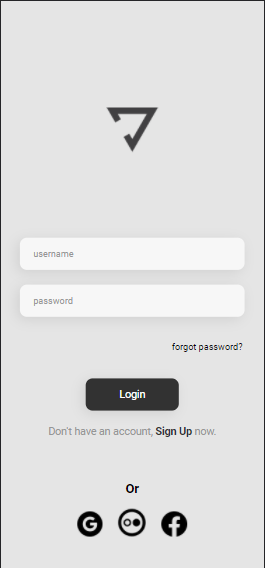

# Yoga-Interface

> Essa Interface foi desenvolvida em conjunto com o professor Rodolfo Mori nas aulas do DevClub. Se trata de uma página de login para um aplicativo relacionado a Yoga.

### Ajustes e melhorias

As próximas atualizações serão voltadas às seguintes tarefas:

 - [ ] Aplicar JavaScript
 - [ ] Aplicar ReactJS
 - [ ] Aplicar Node

## 🤝 Colaboradores

Esse projeto foi desenvolvido individualmente.

<table>
  <tr>
    <td align="center">
      <a href="#">
         
        
          <b>Marcelle Marichal</b>
        
      </a>
    </td>
</table>

[⬆ Voltar ao topo](#Yoga-Interface) 
